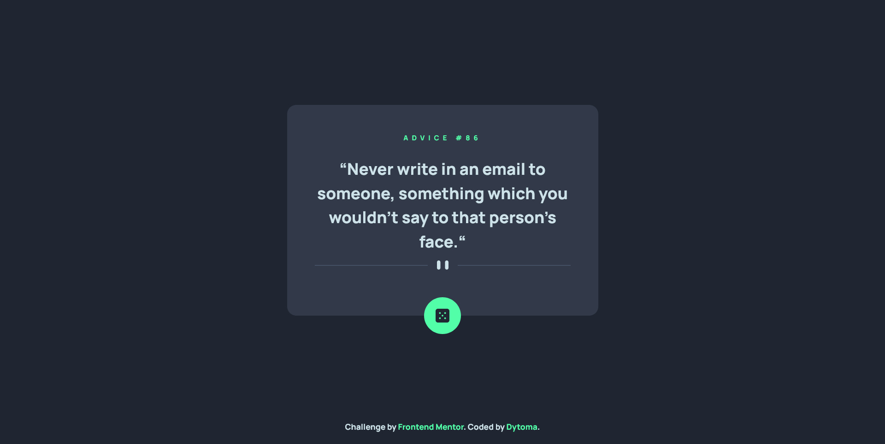

# Frontend Mentor - Advice generator app solution

This is a solution to the [Advice generator app challenge on Frontend Mentor](https://www.frontendmentor.io/challenges/advice-generator-app-QdUG-13db). Frontend Mentor challenges help you improve your coding skills by building realistic projects.

## Table of contents

- [Overview](#overview)
  - [The challenge](#the-challenge)
  - [Screenshot](#screenshot)
  - [Links](#links)
  - [Built with](#built-with)
  - [What I learned](#what-i-learned)
  - [Continued development](#continued-development)
  - [Useful resources](#useful-resources)
- [Author](#author)
- [Acknowledgments](#acknowledgments)


## Overview

### The challenge

Users should be able to:

- View the optimal layout for the app depending on their device's screen size
- See hover states for all interactive elements on the page
- Generate a new piece of advice by clicking the dice icon

### Screenshot



This is a screenshot of my solution.

### Links

- Solution URL: [Add solution URL here](https://your-solution-url.com)
- Live Site URL: [Add live site URL here](https://your-live-site-url.com)

### Built with

- Semantic HTML5 markup
- CSS custom properties
- Flexbox
- CSS Grid
- Mobile-first workflow
- [Tailwindcss](https://tailwindcss.com/docs/installation) - CSS framework.


### What I learned

This is some javascript I learnt while building this project.

```js
const adviceGenerator = async() => {

    try {

        // Make a request to the advice generator via their api using fetch

        const request = await fetch("https://api.adviceslip.com/advice", {cache: 'no-cache'});

        // if the request is ok we proceed 

        if(request.ok) {

            // we await for the request to be converted to json 

            const response = await request.json();

            // And then display the data to our page
            adviceId.innerText = `ADVICE #${response['slip'].id}`;
            quote.innerHTML = `&#8220${response['slip'].advice}&#8220`;
        }
    } catch(error) {
        console.log("Error detected", error);
    }

}
```

### Continued development

Do more projects on APIs and master this subject.

### Useful resources

- [Fetch API](https://developer.mozilla.org/en-US/docs/Web/API/Fetch_API) - This helped me for fetching advices with an api. I really liked this method and will use it going forward.


## Author

- Frontend Mentor - [@Dytoma](https://www.frontendmentor.io/profile/yourusername)


## Acknowledgments

I got inpired by a frontend mentor member when I was stuck on how to use the API to display advices to the html page.
